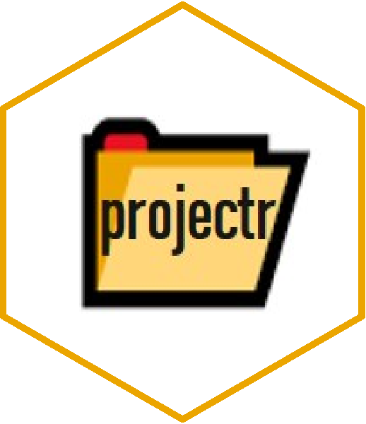

<!-- README.md is generated from README.Rmd. Please edit that file -->

# projectr <a href='#'></a>

<!-- badges: start -->

[](#)
[](https://github.com/Jeniffen/projectr/releases/tag/v0.1.0)
[](https://github.com/Jeniffen/projectr/actions)
[](https://codecov.io/gh/Jeniffen/projectr?branch=master)
<!-- badges: end -->

## Overview

The **projectr** package is designed to be a lightweight package, with
the single goal of taking away the hassle of creating the *right* folder
structure for any data science project. With the boilerplate being
provided, any project can be customized or enhanced to special needs and
requirements.

The resulting folder structure is inspired by [Coockiecutter Data
Science](https://tinyurl.com/y89ay63o) and Edward Ma’s
[blogpost](https://tinyurl.com/ybghtonj) on managing your data science
project early on. Further adjustments were made based on feedback by the
data science community.

## Installation

You can install the development version from
[GitHub](https://github.com/) with:

``` r
# install.packages("devtools")
remotes::install_github("Jeniffen/projectr")
```

## Usage

``` r
projectr::set_me_up("my_project")
#> Your project has been successfully created!
#> Find below an outline of your structure:
#> 
#> my_project                   # This is your project root                 
#> ¦                                                                        
#> +-- data                     # Root folder for data                      
#> ¦   +-- 01_raw               # Folder for all your raw data              
#> ¦   +-- 02_intermediate      # Folder for pre-processed data             
#> ¦   +-- 03_processed         # Folder for fully processed data           
#> ¦   +-- 04_predictions       # Folder to save predictions                
#> ¦                                                                        
#> +-- model                    # Folder to store all your models           
#> ¦                                                                        
#> +-- notebooks                # Root folder for notebooks and Rmd files   
#> ¦   +-- eda                  # Folder for exploratory data analysis      
#> ¦   +-- misc                 # Folder to try things out or stuff         
#> ¦                                                                        
#> +-- references               # Root folder for all explanatory files     
#> ¦   +-- codebooks            # Folder for codebooks of your datasets     
#> ¦   +-- docs                 # Folder for general documentation          
#> ¦   ¦   +-- figures          # Folder to store figure and images         
#> ¦   +-- reports              # Folder to store visualizations and reports
#> ¦                                                                        
#> +-- src                      # Root folder for all your scripts          
#>     +-- 01_preparation       # Folder for setup and prep. scripts        
#>     +-- 02_processing        # Folder for all kind of processing scripts 
#>     +-- 03_modelling         # Folder for all your training scripts      
#>     +-- 04_visualization     # Folder for all your visualisation scripts 
#> 
#> Good luck!
```

## Code of Conduct

Please note that the projectr project is released with a [Contributor
Code of
Conduct](https://github.com/Jeniffen/projectr/wiki#contributor-code-of-conduct).
By contributing to this project, you agree to abide by its terms.
